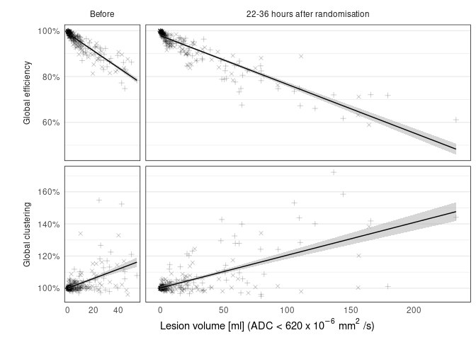

Load data

```r
asz <- 86
source('./prepdata.r')
load('prepdata.RData')
```


```r
require(ggpmisc)
```

```
## Loading required package: ggpmisc
```

```
## Loading required package: ggpp
```

```
## 
## Attaching package: 'ggpp'
```

```
## The following object is masked from 'package:ggplot2':
## 
##     annotate
```

```
## Warning in .recacheSubclasses(def@className, def, env): undefined subclass
## "numericVector" of class "Mnumeric"; definition not updated
```

```r
dd %>% 
  ggplot(aes(x = lesionvolume, y = GGP)) +
  geom_point(aes(fill = treatment, shape = treatment), alpha = .2, stroke = .5) +
  geom_smooth(method = 'lm', color = 'black', size = .5) +
  #geom_smooth(aes(y = stage(GGP, after_stat = y+1), ymin = after_stat(ymin+1), ymax = after_stat(ymax+1))
  #            , method = 'lm', formula = I(y-1)~0+x, color = 'orange', fill = 'orange') +
  #stat_poly_eq(aes(label = paste(..eq.label.., ..rr.label.., sep = "~~~")), 
             #   parse = TRUE) +
  facet_grid(lab ~ visit, switch = 'y', scales = 'free', space = 'free_x'
             , labeller = labeller(visit = c(V0 = 'Before', V3 = '22-36 hours after randomisation')
                                   , lab = c(efficiency = 'Global efficiency', clustering = 'Global clustering'))) +
  scale_x_continuous(expression('Lesion volume [ml] (ADC < 620 x 10'^-6~'mm'^2~'/s)')) +
  scale_y_continuous('', labels = scales::percent_format(accuracy = 1)) +
  scale_shape_manual(values = c(3,4)) +
  guides(fill = 'none', shape = 'none') + 
  theme_minimal() +
  theme(strip.placement = 'outside'
        , panel.grid.minor.x = element_blank()
        , panel.grid.major.x = element_blank()
        , strip.background = element_blank()
        , panel.border = element_rect(color = 'black', fill = NA)
        , plot.background = element_rect(fill = "white", color = NA))
```

```
## `geom_smooth()` using formula 'y ~ x'
```

<!-- -->

```r
ggsave(filename = './../../derivatives/figures/R/Fig-1.png', units = 'cm', width = 18, height = 9, dpi = 600)
```

```
## `geom_smooth()` using formula 'y ~ x'
```


```r
require(lme4)
```

```
## Loading required package: lme4
```

```
## Loading required package: Matrix
```

```
## 
## Attaching package: 'Matrix'
```

```
## The following objects are masked from 'package:tidyr':
## 
##     expand, pack, unpack
```

```r
require(lmerTest)
```

```
## Loading required package: lmerTest
```

```
## 
## Attaching package: 'lmerTest'
```

```
## The following object is masked from 'package:lme4':
## 
##     lmer
```

```
## The following object is masked from 'package:stats':
## 
##     step
```

```r
require(broom.mixed)
```

```
## Loading required package: broom.mixed
```

```r
dd %>% group_by(lab) %>% 
  nest() %>% 
  mutate(mdl = map(data, ~lmer(GGP ~ visit + I(lesionvolume/10) + (1|ID), data = .))
         , tidy = map(mdl, tidy)) %>% 
  unnest(tidy) %>% 
  dplyr::filter(term == 'I(lesionvolume/10)')
```

```
## # A tibble: 2 x 11
## # Groups:   lab [2]
##   lab    data     mdl    effect group term    estimate std.error statistic    df
##   <fct>  <list>   <list> <chr>  <chr> <chr>      <dbl>     <dbl>     <dbl> <dbl>
## 1 effic… <tibble… <lmrM… fixed  <NA>  I(lesi…  -0.0190  0.000457     -41.5  455.
## 2 clust… <tibble… <lmrM… fixed  <NA>  I(lesi…   0.0182  0.00109       16.6  519.
## # … with 1 more variable: p.value <dbl>
```

```r
dd %>% group_by(lab) %>% nest() %>% 
  mutate(fm = map(data, ~lmer(lesionvolume ~ visit + (1|ID), data = .))
         , mdl2 = map2(data, fm, ~lm(I(100*GGP) ~  I(fitted(.y)/10), data = .x))
         , tidy = map(mdl2, ~tidy(., conf.int = TRUE))) %>% 
  unnest(tidy) %>% 
  select(-c(data, statistic))
```

```
## # A tibble: 4 x 9
## # Groups:   lab [2]
##   lab     fm      mdl2  term     estimate std.error   p.value conf.low conf.high
##   <fct>   <list>  <lis> <chr>       <dbl>     <dbl>     <dbl>    <dbl>     <dbl>
## 1 effici… <lmrMd… <lm>  (Interc…   100.       0.223 0            99.5     100.  
## 2 effici… <lmrMd… <lm>  I(fitte…    -3.71     0.106 1.22e-140    -3.91     -3.50
## 3 cluste… <lmrMd… <lm>  (Interc…    98.5      0.429 0            97.6      99.3 
## 4 cluste… <lmrMd… <lm>  I(fitte…     3.45     0.204 7.45e- 52     3.05      3.85
```

```r
dd %>% group_by(lab, visit, treatment) %>% summarise(mean(GGP), sd(GGP)/sqrt(n()))
```

```
## `summarise()` has grouped output by 'lab', 'visit'. You can override using the `.groups` argument.
```

```
## # A tibble: 8 x 5
## # Groups:   lab, visit [4]
##   lab        visit treatment `mean(GGP)` `sd(GGP)/sqrt(n())`
##   <fct>      <chr> <chr>           <dbl>               <dbl>
## 1 efficiency V0    Placebo         0.956             0.00410
## 2 efficiency V0    rtPA            0.959             0.00422
## 3 efficiency V3    Placebo         0.926             0.00765
## 4 efficiency V3    rtPA            0.945             0.00626
## 5 clustering V0    Placebo         1.03              0.00647
## 6 clustering V0    rtPA            1.02              0.00482
## 7 clustering V3    Placebo         1.06              0.0112 
## 8 clustering V3    rtPA            1.02              0.00542
```

```r
dd %>% group_by(lab, visit) %>% 
  nest() %>% 
  mutate(mdl = map(data, ~lm(GGP ~ treatment + lesionvolume, data = .))
         , tidy = map(mdl, tidy)) %>% 
  unnest(tidy) %>% 
  dplyr::filter(term == 'treatmentrtPA') %>% 
  arrange(visit)
```

```
## # A tibble: 4 x 9
## # Groups:   lab, visit [4]
##   lab      visit data        mdl   term     estimate std.error statistic p.value
##   <fct>    <chr> <list>      <lis> <chr>       <dbl>     <dbl>     <dbl>   <dbl>
## 1 efficie… V0    <tibble [2… <lm>  treatme… -9.42e-4   0.00254    -0.371 0.711  
## 2 cluster… V0    <tibble [2… <lm>  treatme… -5.17e-3   0.00711    -0.727 0.468  
## 3 efficie… V3    <tibble [2… <lm>  treatme…  3.59e-3   0.00408     0.881 0.379  
## 4 cluster… V3    <tibble [2… <lm>  treatme… -2.57e-2   0.00966    -2.66  0.00833
```


```r
ddd <- dd %>% group_by(ID, lab) %>% 
  mutate(GGP0 = GGP[visit == 'V0']
         , lesionvolume0 = lesionvolume[visit == 'V0']
         , dGGP = GGP - GGP[visit == 'V0']
         , dvol = lesionvolume - lesionvolume0) %>% 
  dplyr::filter(visit == 'V3') %>% 
  ungroup() %>% group_by(lab)


d.es <- ddd %>% group_by(treatment, lab) %>% 
  summarise(m = mean(dGGP)
            , s = sd(dGGP)/sqrt(n()))
```

```
## `summarise()` has grouped output by 'treatment'. You can override using the `.groups` argument.
```

```r
d.stats <- ddd %>% nest() %>% 
  mutate(mdl = map(data, ~lm(dGGP ~ treatment , data = .))
         , tidy = map(mdl, ~tidy(., conf.int = TRUE))) %>% 
  unnest(tidy) %>% 
  filter(term == 'treatmentrtPA')

d.stats.adj <- ddd %>% nest() %>% 
  mutate(mdl = map(data, ~lm(I(dGGP) ~ treatment + I(lesionvolume0/10) +I(dvol/10), data = .))
         , tidy = map(mdl, ~tidy(., conf.int = TRUE))) %>% 
  unnest(tidy) %>% 
  select(-c(data, mdl, statistic)) %T>% print() %>%  
  filter(term == 'treatmentrtPA')
```

```
## # A tibble: 8 x 7
## # Groups:   lab [2]
##   lab        term                estimate std.error  p.value  conf.low conf.high
##   <fct>      <chr>                  <dbl>     <dbl>    <dbl>     <dbl>     <dbl>
## 1 efficiency (Intercept)         -0.00930  0.00219  2.99e- 5 -0.0136    -0.00499
## 2 efficiency treatmentrtPA        0.00588  0.00279  3.61e- 2  0.000383   0.0114 
## 3 efficiency I(lesionvolume0/10)  0.00630  0.00149  3.16e- 5  0.00337    0.00923
## 4 efficiency I(dvol/10)          -0.0173   0.000628 7.90e-80 -0.0185    -0.0161 
## 5 clustering (Intercept)          0.0137   0.00603  2.37e- 2  0.00184    0.0256 
## 6 clustering treatmentrtPA       -0.0234   0.00768  2.59e- 3 -0.0385    -0.00824
## 7 clustering I(lesionvolume0/10) -0.00161  0.00409  6.95e- 1 -0.00966    0.00645
## 8 clustering I(dvol/10)           0.0140   0.00173  1.88e-14  0.0106     0.0174
```


```r
ddd %>% group_by(lab, ID) %>% 
  ungroup() %>% group_by(lab) %>%  nest() %>% 
  mutate(mdl = map(data, ~lm(I(100*GGP) ~ treatment + I(lesionvolume0/10) + I(dvol/10) + I(100*GGP0), data = .))
         , tidy = map(mdl, tidy)) %>% 
  unnest(tidy) %>% 
  select(-c(data, mdl, statistic)) 
```

```
## # A tibble: 10 x 5
## # Groups:   lab [2]
##    lab        term                estimate std.error  p.value
##    <fct>      <chr>                  <dbl>     <dbl>    <dbl>
##  1 efficiency (Intercept)          -10.7      6.65   1.10e- 1
##  2 efficiency treatmentrtPA          0.601    0.279  3.19e- 2
##  3 efficiency I(lesionvolume0/10)    0.989    0.287  6.58e- 4
##  4 efficiency I(dvol/10)            -1.72     0.0629 3.94e-79
##  5 efficiency I(100 * GGP0)          1.10     0.0672 5.97e-42
##  6 clustering (Intercept)           15.4      6.78   2.35e- 2
##  7 clustering treatmentrtPA         -2.37     0.764  2.14e- 3
##  8 clustering I(lesionvolume0/10)    0.133    0.430  7.58e- 1
##  9 clustering I(dvol/10)             1.49     0.177  2.38e-15
## 10 clustering I(100 * GGP0)          0.860    0.0674 2.43e-29
```

```r
dd %>% group_by(lab,ID) %>% 
  mutate(lesionvolume0 = lesionvolume[visit == 'V0']
         , dvol = lesionvolume - lesionvolume0) %>% 
  ungroup() %>% group_by(lab) %>% nest() %>% 
  mutate(fm = map(data, ~lmer(lesionvolume ~ visit*treatment + (1|ID), data = .))
         , mdl2 = map2(data, fm, ~lm(I(100*GGP) ~  I(fitted(.y)/10), data = .x))
         , mdl = map(data, ~lmer(I(100*GGP) ~ treatment*visit + I(lesionvolume/10) + I(dvol/10) + (1|ID), data = .))
         , tidy = map(mdl, tidy)) %>% 
  unnest(tidy) %>% 
  select(-c(data, group, effect, fm, mdl, mdl2, statistic, df)) 
```

```
## # A tibble: 16 x 5
## # Groups:   lab [2]
##    lab        term                  estimate std.error   p.value
##    <fct>      <chr>                    <dbl>     <dbl>     <dbl>
##  1 efficiency (Intercept)            98.7        0.258  0       
##  2 efficiency treatmentrtPA          -0.0692     0.334  8.36e- 1
##  3 efficiency visitV3                -0.544      0.210  1.01e- 2
##  4 efficiency I(lesionvolume/10)     -3.54       0.135  5.06e-79
##  5 efficiency I(dvol/10)              1.92       0.155  2.46e-30
##  6 efficiency treatmentrtPA:visitV3   0.592      0.288  4.06e- 2
##  7 efficiency sd__(Intercept)         2.17      NA     NA       
##  8 efficiency sd__Observation         1.66      NA     NA       
##  9 clustering (Intercept)           100.         0.658  0       
## 10 clustering treatmentrtPA          -0.536      0.851  5.29e- 1
## 11 clustering visitV3                 1.01       0.560  7.14e- 2
## 12 clustering I(lesionvolume/10)      2.78       0.342  1.20e-14
## 13 clustering I(dvol/10)             -1.23       0.396  1.98e- 3
## 14 clustering treatmentrtPA:visitV3  -2.23       0.768  4.00e- 3
## 15 clustering sd__(Intercept)         5.37      NA     NA       
## 16 clustering sd__Observation         4.42      NA     NA
```


```r
require(forestplot)
```

```
## Loading required package: forestplot
```

```
## Loading required package: grid
```

```
## Loading required package: checkmate
```

```r
es.Placebo.eff <- scales::number(100*as.numeric(d.es[d.es$treatment=='Placebo' & d.es$lab=='efficiency','m']), .01)
es.Placebo.clus <- scales::number(100*as.numeric(d.es[d.es$treatment=='Placebo' & d.es$lab=='clustering','m']), .01)
es.rtPA.eff <- scales::number(100*as.numeric(d.es[d.es$treatment=='rtPA' & d.es$lab=='efficiency','m']), .01)
es.rtPA.clus <- scales::number(100*as.numeric(d.es[d.es$treatment=='rtPA' & d.es$lab=='clustering','m']), .01)

p.eff <- d.stats %>% dplyr::filter(lab=='efficiency') %>% pull('p.value') %>% 
  scales::number(accuracy = .0001)
p.clus <- d.stats %>% dplyr::filter(lab=='clustering') %>% pull('p.value') %>% 
  scales::number(accuracy = .0001)


p.eff.adj <- d.stats.adj %>% dplyr::filter(lab=='efficiency') %>% pull('p.value') %>% 
  scales::number(accuracy = .0001)
p.clus.adj <- d.stats.adj %>% dplyr::filter(lab=='clustering') %>% pull('p.value') %>% 
  scales::number(accuracy = .0001)

tabletext<-list(
  list("", "", "Efficiency", "Clustering")
  ,  list(expression(Delta[GGP]~'[pp]'), "(Placebo)", es.Placebo.eff, es.Placebo.clus)
  , list(expression(Delta[GGP]~'[pp]'), "(Alteplase)", es.rtPA.eff, es.rtPA.clus)
  , list("", "P", p.eff, p.clus)
  ,  list("", expression("P"[adj]), p.eff.adj, p.clus.adj)
  )


tiff("./../../derivatives/figures/R/Fig-2.tiff", width=18.5, height=5, units = 'cm', res = 600)

font <- "HersheyGothicEnglish"
forestplot(tabletext
           , mean  = cbind(c(NA, NA, 100*as.numeric(d.stats %>% dplyr::filter(lab=='efficiency') %>% pull('estimate'))
                             , 100*as.numeric(d.stats %>% dplyr::filter(lab=='clustering') %>% pull('estimate')))
                    , c(NA, NA, 100*as.numeric(d.stats.adj %>% dplyr::filter(lab=='efficiency') %>% pull('estimate'))
                             , 100*as.numeric(d.stats.adj %>% dplyr::filter(lab=='clustering') %>% pull('estimate'))))
           , lower = cbind(c(NA, NA, 100*as.numeric(d.stats %>% dplyr::filter(lab=='efficiency') %>% pull('conf.low'))
                             , 100*as.numeric(d.stats %>% dplyr::filter(lab=='clustering') %>% pull('conf.low')))
                    , c(NA, NA, 100*as.numeric(d.stats.adj %>% dplyr::filter(lab=='efficiency') %>% pull('conf.low'))
                             , 100*as.numeric(d.stats.adj %>% dplyr::filter(lab=='clustering') %>% pull('conf.low'))))
           , upper = cbind(c(NA, NA, 100*as.numeric(d.stats %>% dplyr::filter(lab=='efficiency') %>% pull('conf.high'))
                             , 100*as.numeric(d.stats %>% dplyr::filter(lab=='clustering') %>% pull('conf.high')))
                    , c(NA, NA, 100*as.numeric(d.stats.adj %>% dplyr::filter(lab=='efficiency') %>% pull('conf.high'))
                             , 100*as.numeric(d.stats.adj %>% dplyr::filter(lab=='clustering') %>% pull('conf.high'))))
           , legend_args = fpLegend(pos = list('topright', inset = .15, align='horizontal'), gp=gpar(col="white", fill="snow", fontface=1))
           , legend = c("Unadjusted", "Adjusted")
           , fn.ci_norm = c(fpDrawNormalCI, fpDrawCircleCI)
           #, clip =c(-.125, 0.075)
           , hrzl_lines = list("3" = gpar(lty = 2, columns = 1:5))
           , col = fpColors(box=c("black", "black"), line=c("black", "black"))
           , xlab="Treatment effect [percentage points]"
           , txt_gp = fpTxtGp(label = list(gpar(fontfamily = 'serif', fontface = 1, cex = .7)
                                           , gpar(fontfamiliy = '', fontface=1, cex = .7)
                                           , gpar(fontfamiliy = '', fontface=1, cex = .7)
                                           , gpar(fontfamiliy = '', fontface=1, cex = .7)
                                           , gpar(fontfamiliy = '', fontface=1, cex = .7))
                              , ticks = gpar(cex = .6)
                              , xlab = gpar(cex = .6))
           , line.margin = .6
           , boxsize = .2
           )
dev.off()
```

```
## png 
##   2
```


```r
mm <- dd %>% group_by(ID, lab) %>% 
  mutate(dGGP = GGP - GGP[visit == 'V0']
         , llv = log(lesionvolume[visit == 'V0'])
         , dvol = log(lesionvolume/lesionvolume[visit == 'V0'])) %>% 
  dplyr::filter(visit == 'V3') %>% 
  ungroup() %>%  group_by(lab) %>% nest() %>% 
  mutate(mdl = map(data, ~glm(not(goodOutcome) ~ treatment + NIHSS  + age + llv  + I(dGGP*100), data = . , family = binomial(link = 'logit')))
         , tidy = map(mdl, ~tidy(., exponentiate = TRUE, conf.int = TRUE))) 

mm %>% 
  unnest(tidy) %>% 
  dplyr::select(-c(data, mdl, statistic))
```

```
## # A tibble: 12 x 7
## # Groups:   lab [2]
##    lab        term          estimate std.error    p.value conf.low conf.high
##    <fct>      <chr>            <dbl>     <dbl>      <dbl>    <dbl>     <dbl>
##  1 efficiency (Intercept)      0.124    0.918  0.0228       0.0192     0.718
##  2 efficiency treatmentrtPA    0.564    0.294  0.0515       0.315      1.00 
##  3 efficiency NIHSS            1.21     0.0441 0.0000190    1.11       1.32 
##  4 efficiency age              1.01     0.0131 0.434        0.985      1.04 
##  5 efficiency llv              1.17     0.110  0.162        0.942      1.45 
##  6 efficiency I(dGGP * 100)    0.876    0.0538 0.0139       0.781      0.965
##  7 clustering (Intercept)      0.140    0.917  0.0319       0.0218     0.813
##  8 clustering treatmentrtPA    0.580    0.295  0.0648       0.324      1.03 
##  9 clustering NIHSS            1.23     0.0441 0.00000214   1.13       1.35 
## 10 clustering age              1.01     0.0131 0.560        0.982      1.03 
## 11 clustering llv              1.19     0.110  0.114        0.961      1.48 
## 12 clustering I(dGGP * 100)    1.09     0.0382 0.0319       1.02       1.18
```

